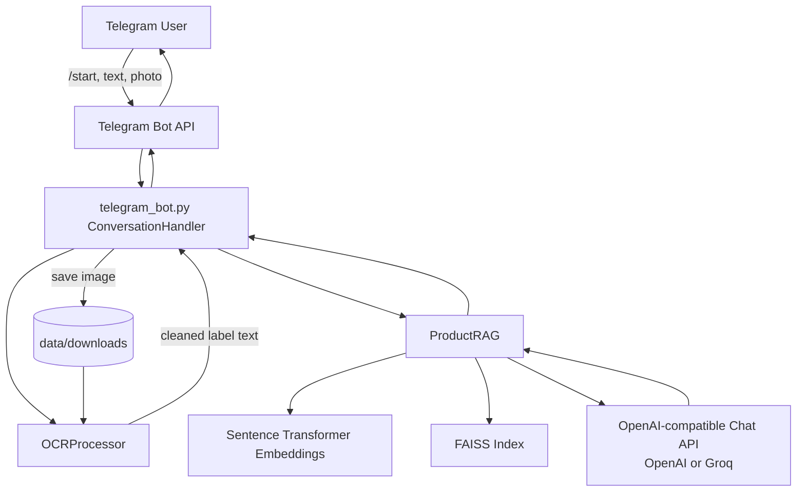

---
# EasyCompare – AI-Powered Shopping Assistant 🚀

## Overview

EasyCompare is a **Telegram bot** that helps compare grocery-style products: users send a **question**, a **competitor / retailer name**, and a **photo** of a product label. The pipeline runs **OCR** on the image, **retrieves** similar items from a small in-repo catalog with **FAISS + sentence embeddings**, then asks an **LLM** to answer using that context.


Built for a procurement / category-management angle (HerHackathon 2024, ALDI Süd context). Details and narrative: 

🔧 My Contributions <br>
Hackathon Execution & Product Vision – Led the strategic direction, ensuring the solution aligned with ALDI Süd's business needs. I also took charge of pitching the product to stakeholders, demonstrating its real-world impact. <br>

User Input & Processing – Designed and implemented the user interaction flow, allowing users to submit product images and brand names via Telegram, using Python and the Telegram Bot API. Contributed to designing a scalable and modular system, ensuring efficient data flow from user input to AI analysis and output generation, using Flask and FastAPI.

🎬 Want to see the full journey? <br>
Check out this page for a detailed breakdown, technical insights, and behind-the-scenes decisions: <br>
👉 [Notion — Easy Compare](https://galvanized-plough-704.notion.site/Easy-Compare-ChatBot-for-AldiSud-1c762a11e1ec808692c9d779825d2361).

This project proved to me that having the right skills, mindset, strategy, and product vision can lead to unexpected wins. It also reinforced my passion for building smart, user-friendly products that solve real business challenges. 🚀

## Architecture



## Design Decisions

- **Conversation-first UX**: implemented a stateful Telegram flow (`/start` -> question -> competitor -> photo) to keep user input structured and reduce prompt ambiguity.
- **Hybrid retrieval + generation**: used FAISS retrieval over product descriptions before LLM generation so answers are grounded in nearby catalog entries, not only model priors.
- **Provider abstraction via OpenAI-compatible API**: support for `OPENAI_BASE_URL` allows switching between OpenAI and Groq without changing business logic.
- **Graceful failure paths**: explicit user-facing handling for invalid API keys and quota/rate-limit errors improves reliability and debugging experience.
- **Local OCR preprocessing**: image preprocessing + OCR run locally to preserve control over extraction quality and avoid introducing additional external OCR services.
- **Testability over heavy imports**: moved native/heavy imports (OCR/RAG backends) closer to runtime paths to make unit tests stable and fast in CI-like environments.

## 🚀 Getting Started  

### 1️⃣ Clone the Repository  
```bash
git clone https://github.com/hsirenko/Aldi.git
cd Aldi
```

Use **Python 3.9+** (3.12 recommended; matches typical `torch` / `transformers` setups).

### 2. Virtual environment

```bash
python3 -m venv venv
source venv/bin/activate   # macOS / Linux
# venv\Scripts\activate   # Windows
```

### 3️⃣ Install Dependencies
```bash
pip install -r requirements.txt
```

Install [Tesseract OCR](https://github.com/tesseract-ocr/tesseract) on your system, or set `TESSERACT_CMD` in `.env` to the binary path.

### 4️⃣ Set Up Environment Variables

```bash
cp .env.example .env
```

Edit `.env`: set `TELEGRAM_BOT_TOKEN` (from BotFather) and `OPENAI_API_KEY`. Never commit `.env`.

For Groq (OpenAI-compatible API), set:

```bash
OPENAI_API_KEY=gsk_...
OPENAI_BASE_URL=https://api.groq.com/openai/v1
OPENAI_MODEL=llama-3.1-8b-instant
```

For deterministic offline fallback mode, set:

```bash
# off (default): online provider only
# auto: online provider with local deterministic fallback on failure
# on: local deterministic provider only (no OpenAI/Groq calls)
OFFLINE_FALLBACK_MODE=auto
```


### 5️⃣ Run the Telegram bot

```bash
python bot.py
```

You can also run `python telegram_bot.py` directly.

### 6. Optional: Streamlit sample UI

Static sample table only (no keys required):

```bash
streamlit run product_comparison.py
```

### 7. Run tests

```bash
# Option A: explicit venv interpreter (recommended)
./venv/bin/python -m pytest -q

# Option B: after activating venv first
source venv/bin/activate
python -m pytest -q
```

Coverage is enabled by default via `pytest.ini` and enforced with a fail-under gate.

## Using the bot

1. Open Telegram, find your bot, send `/start`.
2. Send your **question** as text.
3. Send the **competitor / retailer** name.
4. Send a **photo** of the product; the bot replies with an LLM answer grounded in OCR + retrieved catalog lines.

Send `/cancel` to abort the flow.

## Security

- **Rotate** any API keys or bot tokens that were ever committed to git or shared; use only `.env` locally and in deployment secrets.
- The sample product table is illustrative; extend `df_description` in `telegram_bot.main()` or load from CSV for real demos.

### 💬 How to Use the Telegram Chatbot  
1️⃣ Open Telegram and search for your bot.  
2️⃣ Start a chat with the bot using `/start`.  
3️⃣ Send an image of a product and specify the brand name in the message.  
4️⃣ The bot will analyze the image and return comparisons with similar products.  

### 🔧 Troubleshooting  
If the bot doesn't respond, check that:  
✅ The bot token is correctly set in `.env`  
✅ The server is running and listening for requests  
✅ Dependencies are correctly installed  
